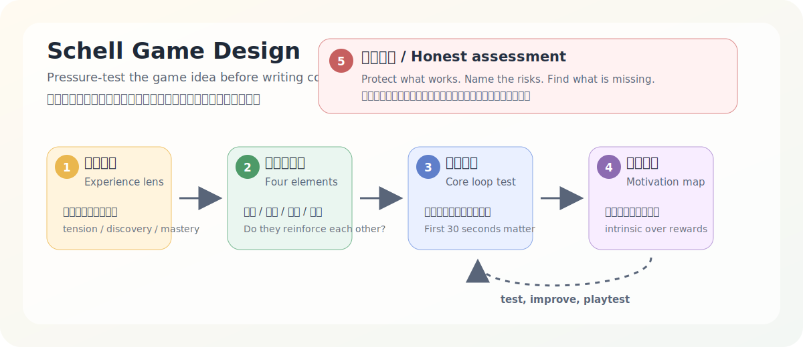

# Schell Game Design / 谢尔游戏设计顾问

  

## 中文说明

这是一个用于游戏开发前期策划的 Codex Skill。它基于 Jesse Schell《游戏设计艺术》中的思考框架，帮助用户在开始写代码之前，先把游戏创意压实。

它适合这些场景：

- 你有一个游戏点子，但还不确定它是否站得住。
- 你想在开发前检查玩法、故事、美术方向和技术限制是否互相支持。
- 你需要有人用直接、诚实的方式指出设计里的风险。
- 你希望把模糊的想法整理成可以原型验证的设计方向。

这个 Skill 会按阶段引导用户，而不是一次性给出一大堆建议：

1. **体验视角**：先确认玩家应该感受到什么。
2. **四要素审计**：检查机制、故事、美学和技术是否成立。
3. **核心回路压力测试**：确认最常重复的玩法本身是否有趣。
4. **玩家动机图**：区分玩家是因为乐趣回来，还是只被奖励牵着走。
5. **诚实评估**：指出有效部分、风险、缺失内容和下一步行动。

它不会替你直接写游戏代码。它的目标是在开发前帮助你少走弯路，先验证游戏设计是否值得继续投入。

## English

This is a Codex Skill for early-stage game planning. It uses Jesse Schell's *The Art of Game Design* lenses to help users pressure-test a game idea before development begins.

Use it when:

- You have a game idea but are not sure whether it is solid.
- You want to check whether mechanics, story, aesthetics, and technology support the same player experience.
- You need direct, honest design feedback before spending time building.
- You want to turn a vague concept into something that can be prototyped and tested.

The Skill guides the user step by step instead of overwhelming them with a full design lecture:

1. **Experience Lens**: define what the player should feel.
2. **Four Elements Audit**: evaluate mechanics, story, aesthetics, and technology.
3. **Core Loop Stress Test**: check whether the repeated play action is satisfying on its own.
4. **Player Motivation Map**: separate intrinsic motivation from external rewards.
5. **Honest Assessment**: identify strengths, risks, missing pieces, and next steps.

This Skill does not build the game or write production code. Its purpose is to help you validate the design direction before development starts.

## Files

- `SKILL.md`: the Skill instructions.
- `agents/openai.yaml`: interface metadata for Codex.
- `assets/schell-flow.svg`: a hand-authored workflow diagram used by this README.

## Repository

GitHub: https://github.com/threeaus/schell-game-design
